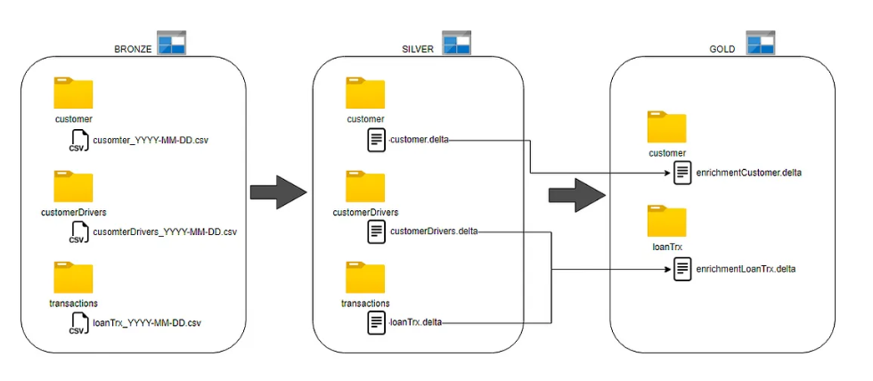

# Azure Data Processing Pipeline Project

Welcome to the Azure Data Processing Pipeline project, an end-to-end data engineering initiative leveraging the power of the Azure cloud platform. This project is crafted to demonstrate the deployment and management of resources using Terraform, alongside developing a comprehensive data pipeline utilizing Delta Lake and Azure Databricks.

## Overview

This project encapsulates the creation of an end-to-end data pipeline on Azure, employing Delta Lake—an open-source storage layer that ensures ACID transactions and effective metadata handling. Through this pipeline, we orchestrate data movement from the bronze to gold layers, demonstrating incremental load strategies, external table creation for data analytics, and pipeline orchestration, leveraging tools like PySpark, Azure Data Lake Storage (ADLS), Azure Databricks, and Azure Data Factory.


## Use Case Explanation

In this project, we handle transactional data pertaining to loan transactions and customers from GeekBankPE, a renowned global banking institution. Our focus is on fulfilling two primary requirements:

1. **Marketing**: To maintain updated customer data for targeted communications and offer dissemination.
2. **Finance**: To analyze daily loan transactions, augmented with customer data, aiming to enhance revenue streams.

To achieve these objectives, the project employs incremental loads and upsert techniques to manage data effectively.

## Architecture

We adhere to the Delta Lake architecture, segmenting data into three pivotal layers:

- **Bronze Layer**: The repository for raw data.
- **Silver Layer**: The stage for data transformation.
- **Gold Layer**: The final layer, hosting enriched and aggregated data ready for analysis.



  

## Data Dictionary

Understanding the data is crucial. Below is a brief overview of the datasets involved:

- **Customer**: Utilizes UPSERT operations for new or altered records.
- **Customer Drivers**: Daily generated data from the RiskModeling department, capturing snapshot insights.
- **Loan Transactions**: Details on daily transactional activities, incrementally loaded for analysis.


## Key Components

- **Azure Resource Group**: Encapsulates related Azure resources.
- **Databricks Workspace**: Offers a collaborative environment for data processing.
- **Azure Data Lake Storage Gen2**: Our chosen storage solution, tailored for large-scale data analytics.
- **Azure Service Principal**: Manages permissions and access, ensuring secure resource interaction.

## Data Ingestion and Transformation Process

1. **Data Upload**: Import your datasets into the bronze layer.
2. **Mount Storage Containers**: Use the script located in `set_up/adsl_mount_storage` to mount the Azure Storage Gen2 containers to Databricks.
3. **Data Ingestion**: Employ `ingestion` scripts to move data to Databricks, transforming it for the silver layer.
4. **Data Enrichment**: Scripts in the `enrichment` folder enhance data for specific use cases, storing outcomes in the gold layer.

## Post-Processing Steps

After executing the notebooks within the Databricks folders, the data is refined and stored in the gold container, utilizing the Delta format. Then create a database that interfaces with this gold-layer data, enabling advanced analytics and insights.

### Creating External Table

Note: If you drop your database which is mounted on your gold container, all the files inside that container are going to be deleted too.

```sql
-- Execute this SQL command within your Databricks database notebook
CREATE EXTERNAL TABLE IF NOT EXISTS your_table_name
USING DELTA
LOCATION '/path/to/your/gold/container/directory';
```

## Testing and Validation

- **Pipeline Verification**: Use the `test_ingestion_pipeline` notebook to ensure the pipeline's functionality.
- **Data Querying**: Post-processing, query database tables to validate data accuracy and integrity.

## Orchestrating Workflows with Azure Data Factory

Upon finalizing and validating our notebooks using the `test_ingestion_pipeline` notebook, the next step is to orchestrate, schedule, and monitor our data processing workflows. Azure Data Factory (ADF) serves as a powerful platform for this purpose, offering cloud-based ETL and data integration services that enable the creation of data-driven workflows for orchestrating data movement and data transformation at scale.

### Step 1: Set up Azure Data Factory Service

Initiate by setting up your Azure Data Factory service, which will serve as the backbone for your data orchestration.

### Step 2: Create a Data Pipeline

With Azure Data Factory, you can create a pipeline that defines the data-driven workflows:

1. **Databricks Notebook Activity**: In your ADF interface, search for the Databricks notebook activity. Drag and drop this activity into your pipeline workspace.
   
2. **Create a Databricks Linked Service**: Select your activity, navigate to the Azure Databricks tab, and establish a linked service.

3. **Configure Notebook Activity**: Select your notebook activity, go to settings, and click on 'Browse'. Locate your 'customer notebook' within the ingestion folder and confirm by clicking 'OK'.

### Step 3: Configuring Subsequent Notebooks

- **Activity Duplication**: Right-click to copy your configured activity, altering the name for each new instance.
- **Notebook Selection**: For each copied activity, select the appropriate notebook from the ingestion and enrichment folders.


### Step 4: Debugging and Linking

After setting up all activities:

- **Linking**: Ensure that all activities are appropriately linked to define the flow of your pipeline.
- **Debugging**: Utilize the debug feature to test and validate your pipeline's functionality.

### Step 5: Trigger Creation and Association

- **Create a Trigger**: This trigger will automate your pipeline execution based on your specified configurations.
- **Associate the Trigger**: Link your newly created trigger with your pipeline to automate its execution.

### Step 6: Publishing and Monitoring

- **Publish**: Navigate to 'Publish' and confirm to deploy your pipeline configurations to the Data Factory service.
- **Monitoring**: Post-publishing, you can monitor the pipeline's execution within the 'Monitor' tab to ensure it's running as expected.

By following these steps, your data processing workflows will be effectively orchestrated, scheduled, and monitored, leveraging the robust capabilities of Azure Data Factory to enhance the automation and efficiency of your data processing pipeline.


## Additional Resources

- [Deploying Azure Services with Terraform](Terraform/README.md)

## Conclusion

By following this project, you'll gain hands-on experience with Azure's data services, understanding how to construct a robust data processing pipeline. Whether you're targeting data analytics, pipeline optimization, or cloud resource management, this project offers a comprehensive learning journey.
